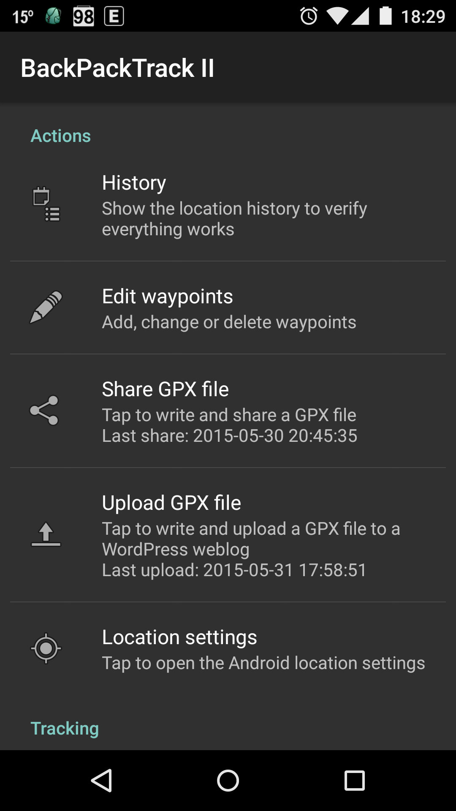

# BackPackTrack II

Description
-----------

BackPackTrack II is an open source utility application meant to continuously record your location,
without draining your battery and without requiring an internet connection.

The GPS will be switched on every 3 minutes for a maximum of 60 seconds (both configurable) to acquire a location,
but only if you are moving.
If there is not at least one satelite after 30 seconds visible (configurable), the GPS will be turned off.
When the GPS cannot get a fix, a network location will be used as backup.

BackPackTrack II will also passively use locations requested by other applications, for example mapping applications.
Passive locations will be recorded if the bearing changes by more than 30 degrees
or if the altitude changes more than 20 meter (both configurable).

Locations will be filtered based on distance from your last location and based on location accuracy.
The default is to filter locations within 100 meter of the last location and locations with an accuracy of worse than 100 meter.

The altitude of GPS locations will be corrected using the [EGM96](http://en.wikipedia.org/wiki/EGM96) model,
which can make a significant difference in some areas.

From the status bar notification you can make an extra trackpoint or a new waypoint.
Waypoints will be automatically reverse geocoded if there is an internet connection,
otherwise this can be done later using the waypoint editor.

You can export your location history as a GPX file for visualization in another application.
You could use [OsmAnd](https://play.google.com/store/apps/details?id=net.osmand) for this purpose.

You can upload your location history to a WordPress weblog using a small [WordPress plugin](https://wordpress.org/plugins/backpacktrack-for-android/).
You could use the [Google Maps GPX Viewer](https://wordpress.org/plugins/google-maps-gpx-viewer/) plugin for visualization.

If you want to see the status of the GPS, you could use [GPS Status & Toolbox](https://play.google.com/store/apps/details?id=com.eclipsim.gpsstatus2).

BackPackTrack II is a complete rewrite of [BackPackTrack](https://github.com/M66B/BackPackTrack), the first Android application I wrote in 2011.

You can download the latest version of the application from the [Play store](https://play.google.com/store/apps/details?id=eu.faircode.backpacktrack2).

Works on Android 4.1 (Jelly Bean) and later.

You can ask questions [here](http://forum.xda-developers.com/android/apps-games/app-backpacktrack-ii-t3123682).

Frequently asked questions
--------------------------

**(1) Are Google Play services required?**

No, but acquiring locations will not stop if you are still (not moving) anymore.
Unfortunately there are no open source libraries available to detect user activity (what you are doing).

**(2) How can I stop this application?**

BackPackTrack II is meant to continuously record your location, so there is no exit or quit option/menu.
If you want to stop tracking, you can uncheck the check box labelled with *Tracking enabled*.

Acknowledgements
----------------

* The launcher/application icon was taken from [Wikimedia Commons](http://commons.wikimedia.org/wiki/File:Exquisite-backpack.svg "Exquisite backpack")
* Notification icon made by [Freepik](http://www.freepik.com "Freepik") from [www.flaticon.com](http://www.flaticon.com "Flaticon") is licensed under [CC BY 3.0](http://creativecommons.org/licenses/by/3.0/ "Creative Commons BY 3.0")
	* Listed [here](http://www.flaticon.com/free-icon/backpacker_10595)

The following libraries are being used:

* [Gson](https://github.com/google/gson) (JSON serialization)
* [Play Services](http://developer.android.com/google/play-services/) (activity recognition)
* [aXMLRPC](https://github.com/timroes/aXMLRPC) (XML-RPC)
* [jdom2](http://www.jdom.org/) (GPX)

Screenshot
----------

