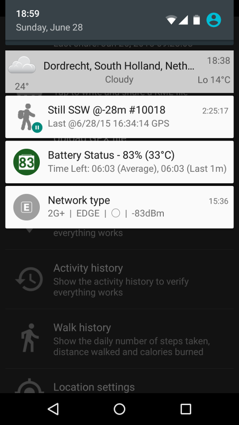
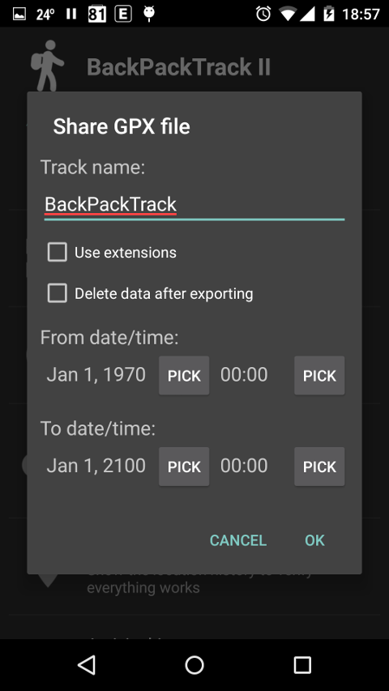
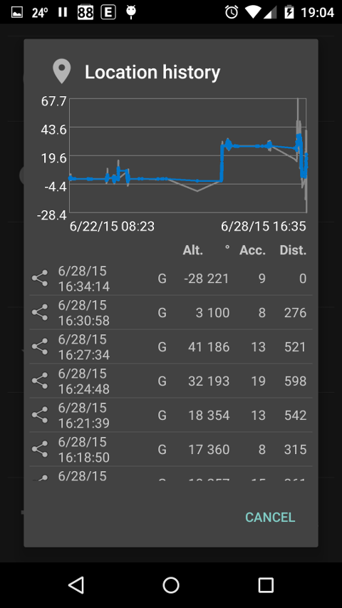
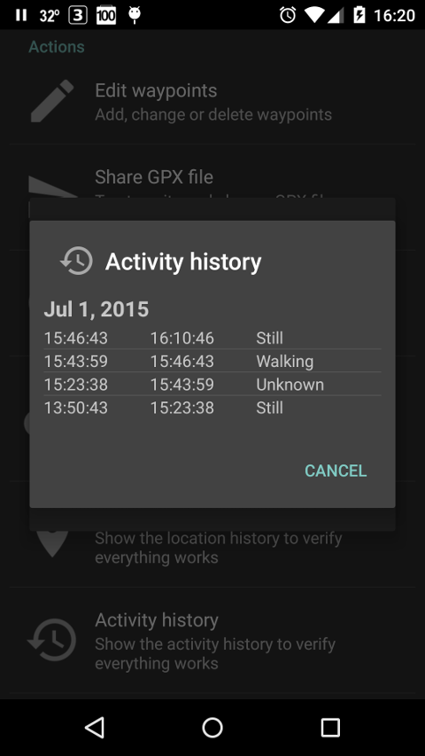

# BackPackTrack II

Description
-----------

BackPackTrack II is an open source utility application meant to continuously record your location,
without draining your battery and without requiring an internet connection.

The GPS will be switched on every 3 minutes for a maximum of 60 seconds (both configurable) to acquire a location,
but only if you are moving.
If there is not at least one satellite visible after 30 seconds (configurable), the GPS will be turned off.
When the GPS cannot get a fix, a network location will be used as backup.

BackPackTrack II will also passively use locations requested by other applications, for example mapping applications.
Passive locations will be recorded if the bearing changes by more than 30 degrees
or if the altitude changes by more than 20 meter (both configurable).

Locations will be filtered based on distance from your last location and based on location accuracy.
The default is to filter locations within 100 meter of the last location and locations with an accuracy of less than 100 meter.

The altitude of GPS locations will be corrected using the [EGM96](http://en.wikipedia.org/wiki/EGM96) model,
which can make a significant difference in some areas.

From the status bar notification you can make an extra trackpoint or a new waypoint.
Waypoints will be automatically reverse geocoded if there is an internet connection,
otherwise this can be done later using the waypoint editor.

You can export your location history as a GPX or KML file for visualization in another application.
You could use [OsmAnd](https://play.google.com/store/apps/details?id=net.osmand) or [Google Earth](https://play.google.com/store/apps/details?id=com.google.earth) for this purpose.

You can upload your location history to a WordPress weblog using a small [WordPress plugin](https://wordpress.org/plugins/backpacktrack-for-android/).
You could use the [Google Maps GPX Viewer](https://wordpress.org/plugins/google-maps-gpx-viewer/) plugin for visualization.

If you want to see the status of the GPS, you could use the application [GPS Status & Toolbox](https://play.google.com/store/apps/details?id=com.eclipsim.gpsstatus2).

As a bonus BackPackTrack includes:

* an activity history, so you can see when you were doing what
* a step counter which doesn't count false steps, because activity recognition will be used to count steps only while you are walking. Your device needs to have a hardware step counter for this to work.

BackPackTrack II is a complete rewrite of [BackPackTrack](https://github.com/M66B/BackPackTrack), the first Android application I wrote in 2011.

You can download the latest version of the application from the [Play store](https://play.google.com/store/apps/details?id=eu.faircode.backpacktrack2).

Works on Android 4.1 (Jelly Bean) and later.

You can ask questions [here](http://forum.xda-developers.com/android/apps-games/app-backpacktrack-ii-t3123682).

If you like BackPackTrack II, you can let me know through a small [PayPal donation](https://www.paypal.com/cgi-bin/webscr?cmd=_s-xclick&hosted_button_id=GLEM6UVPH9A64).

Frequently asked questions
--------------------------

**(1) Are Google Play services required?**

No, but acquiring locations will not stop if you are still (not moving) anymore.
Unfortunately there are no open source libraries available to detect user activity (what you are doing).

The version information shows if a usable version of Google Play services is installed.

**(2) How can I stop this application?**

BackPackTrack II is meant to continuously record your location, so there is no exit or quit option/menu.
If you want to stop tracking, you can uncheck the check box labelled *Tracking enabled* found in the location tracking sub-menu.

**(3) What is needed to make (reverse) geocoding work?**

The Google Geocoder needs to be present on your device.
See the version information to see if it is available.

**(4) Why is the number of steps low?**

Counting steps will start when the activity *on foot* has been recognized and will stop when any other activity has been recognized,
which means that BackPackTrack II, unlike most similar applications, doesn't count false steps, for example when traveling in a vehicle.

Note that your device needs to have a hardware step counter for step counting to work.
See the version information to check if this is the case.

**(5) Why is the number of calories low?**

Unlike most similar applications, BackPackTrack shows an estimate of the **net** number of calories burned.
If you want to see a higher number of calories, walk more ;-)

**(6) What is a waypoint/trackpoint?**

Locations are recorded either as waypoint or trackpoint.
The difference between a waypoint and a trackpoint is that a waypoint has a name and a trackpoint does not.
Waypoints can be edited by the waypoint editor, but trackpoints cannot.
It is the waypoints and trackpoints which are being exported to a GPX file.
Most GPX visualization tools connect trackpoints by line segments, designating the path you have followed.
Waypoints are mostly represented by symbols, like a little flag.

**(7) What are GPX extensions?**

GPX extensions are [non standard data elements](http://www.topografix.com/gpx/1/1/#type_extensionsType).

BackPackTrack II can write the following GPX extension elements:

* Provider
* Speed
* Bearing
* Accuracy
* Recognized activity type
* Recognized activity confidence
* Step count

**(8) Can I automate things?**

Yes, you can, for example with [Tasker](http://tasker.dinglisch.net/).

Enable/disable tracking:

* *am startservice -a eu.faircode.backpacktrack2.TRACKING --ez Enable false*
* *am startservice -a eu.faircode.backpacktrack2.TRACKING --ez Enable true*

The default is to enable tracking.

Request trackpoint/waypoint:

* *am startservice -a eu.faircode.backpacktrack2.TRACKPOINT*
* *am startservice -a eu.faircode.backpacktrack2.WAYPOINT*

Write/upload GPX/KML:

* *am startservice -a eu.faircode.backpacktrack2.WRITE_GPX*
* *am startservice -a eu.faircode.backpacktrack2.WRITE_KML*
* *am startservice -a eu.faircode.backpacktrack2.UPLOAD_GPX*

Make sure you have configured your weblog URL and authorization data before trying to upload.

Possible parameters:

* *--es TrackName "Test"* (default: "BackPackTrack")
* *--ez WriteExtensions false* (default: false)
* *--ez DeleteData false* (default: false)
* *--es TimeFrom "1970-1-1"* (default: beginning of time)
* *--es TimeTo "2016-1-1"* (default: end of time)

For example:

*am startservice -a eu.faircode.backpacktrack2.WRITE_GPX --es TrackName "Test" --ez WriteExtensions false --ez DeleteData false --es TimeFrom "1970-1-1" --es TimeTo "2016-1-1"*

Get Google elevation data:

* *am startservice -a eu.faircode.backpacktrack2.GET_ALTITUDE --es TimeFrom "2015-6-27" --es TimeTo "2015-6-28"*

When no time from/to is specified, the default is yesterday.

Tasker use case examples

Starting/stopping tracking based on a location:

* Create a task and give it a name
* Select Code - Run Shell
* Command: *am startservice -a eu.faircode.backpacktrack2.TRACKING --ez Enable true*
* Select option "Use Root"
* Create a Profile and select Location.
* Enter the desired LAT/LONG coordinates, select a radius and whether to use Network and/or GPS location.
* Link it to the Task create above.

Additionally an exit task can be created to stop tracking once you arrive back at the same location

* Command: *am startservice -a eu.faircode.backpacktrack2.TRACKING --ez Enable false*

Creating a launcher shortcut to write a GPX file:

* Create a task and give it a name
* Select Code - Run Shell
* Command: *am startservice -a eu.faircode.backpacktrack2.WRITE_GPX --es TrackName "Test" --ez WriteExtensions false --ez DeleteData false --es TimeFrom "1970-1-1" --es TimeTo "2015-1-1"*
* Select option "Use Root"
* Select an icon for the task

Use your laucher's options for adding a Tasker widget to the homescreen

Capture a Trackpoint when a photo is taken:

* Create a task and give it a name
* Select Code - Run Shell
* Command: *am startservice -a eu.faircode.backpacktrack2.TRACKPOINT*
* Select option "Use Root"
* Create a profile and select Event
* Select System - Intent Recieved
* Under Action enter: *android.hardware.action:NEW_PICTURE*
* Link it to the Task create above.

Android permissions
-------------------

* ACTIVITY_RECOGNITION: to recognize your activity (still, on foot, in vehicle, etc)
* RECEIVE_BOOT_COMPLETED: to start tracking / activity recognition after a reboot
* ACCESS_COARSE/FINE_LOCATION: to acquire locations from the Android location manager
* VIBRATE: to give feedback after making a waypoint / uploading a GPX file (imagine bright sunlight)
* READ/WRITE_EXTERNAL_STORAGE: to write GPX files to the external/shared storage
* INTERNET: to upload GPX files (solely)
* ACCESS_NETWORK_STATE: to disable/enable the upload menu
* WAKE_LOCK: to keep your device awake while processing locations, steps, etc in the background

Activity recognition (provided by Google Play services) does not require internet access.

The Android location manager needs internet access to acquire network locations (but not for GPS locations).

Battery usage
-------------

BackPackTrack will mainly consume power for two things:

* To acquire locations using the GPS
* To recognize your activity

The frequency and duration the GPS is being switched on can be configured.

The frequency the GPS will be switched on is equal to the tracking frequency, which is a matter of personal preference.
Acquiring a location more often will result in more trackpoints at the expense of more power usage.

The duration the GPS will be switched on depends on the preferred accuracy, the location time-out and the satellite check time / count.
The time to a location fix is different for different device types,
so there may be some room to tune the location time-out and the satellite check time / count for your device.
Leaving the GPS on, while there is no chance for a location fix, for example when you are indoors, is a waste of power.

The frequency at which your activity is being recognized can be configured as well.
Devices with a significant motion sensor (see version information) will automatically reduce the frequency when still (not moving).
Reducing the activity recognition interval for devices without a significant motion sensor will probably result in less power usage when still.
Activity recognition does consume a lot less power than using the GPS, so power used for activity recognition is not wasted.

Acknowledgements
----------------

* The launcher/application icon was taken from [Wikimedia Commons](http://commons.wikimedia.org/wiki/File:Exquisite-backpack.svg "Exquisite backpack")
* [Backpacker](http://www.flaticon.com/free-icon/backpacker_10595) icon made by [Freepik](http://www.freepik.com "Freepik") from [www.flaticon.com](http://www.flaticon.com "Flaticon") is licensed under [CC BY 3.0](http://creativecommons.org/licenses/by/3.0/ "Creative Commons BY 3.0")
* Activity icons from [Material icons](https://www.google.com/design/icons/)

The following libraries are being used:

* [Gson](https://github.com/google/gson) (JSON serialization)
* [Play Services](http://developer.android.com/google/play-services/) (activity recognition)
* [aXMLRPC](https://github.com/timroes/aXMLRPC) (XML-RPC)
* [jdom2](http://www.jdom.org/) (GPX)
* [GraphView](http://www.android-graphview.org/) (graphs)
* [Joda-Time](http://www.joda.org/joda-time/) (time calculations)

Screenshots
-----------

